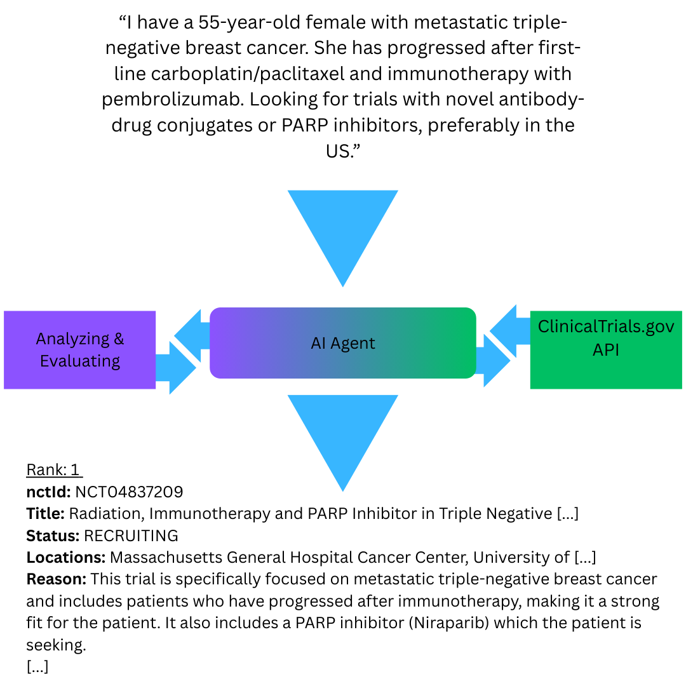

# 🧠 Clinical Trial Matcher AI Agent  



## Overview  
This repository contains a **Clinical Trial Matcher AI Agent** that intelligently extracts key patient details from free-text descriptions and matches them to relevant clinical trials using the [ClinicalTrials.gov API](https://clinicaltrials.gov/).  

Designed for oncologists, researchers, and healthcare professionals, this solution uses **LLM-based reasoning** to:  
- Parse unstructured patient descriptions into structured data (condition, intervention, age, gender, location).  
- Search clinical trial databases using Boolean logic for precise filtering.  
- **Rank trials** based on patient eligibility and relevance, providing a short explanation for each match.  

This project is entirely **notebook-based** (`.ipynb`) for easy experimentation — no GUI is required.  

---

## ✨ Features  
✅ **Automated Key Fact Extraction** – Converts messy patient descriptions into structured, machine-readable data.  
✅ **Smart Trial Search** – Queries ClinicalTrials.gov with Boolean operators for precise filtering.  
✅ **Relevance Ranking** – Ranks trials based on clinical appropriateness, with short justifications.  
✅ **Customizable Agents** – Easily swap or fine-tune LLMs for improved domain-specific performance.  
✅ **End-to-End Pipeline** – From input text → trial search → ranked output, all in one flow.  

---

## 📊 Example Workflow  

**Input:**  
> *"I have a 55-year-old female with metastatic triple-negative breast cancer. She has progressed after first-line carboplatin/paclitaxel and immunotherapy with pembrolizumab. Looking for trials with novel antibody-drug conjugates or PARP inhibitors, preferably in the US."*

**AI Output:**  
```
Rank: 1
nctId: NCT04837209
Title: Radiation, Immunotherapy and PARP Inhibitor in Triple Negative Breast Cancer
Status: RECRUITING
Locations: Massachusetts General Hospital Cancer Center, University of Pennsylvania, Duke University Medical Center
Reason: This trial is specifically focused on metastatic triple-negative breast cancer and includes patients who have progressed after immunotherapy, making it a strong fit for the patient. It also includes a PARP inhibitor (Niraparib) which the patient is seeking.

Rank: 2
nctId: NCT05933265
Title: Study of LP-184 in Patients With Advanced Solid Tumors
Status: RECRUITING
Reason: While this trial addresses advanced solid tumors including TNBC, it does not mention PARP inhibitors or ADCs, but the patient’s eligibility still fits.
```

---

## 🛠️ Technical Details  

### 1. **Key Fact Extraction**
```python
class KeyFacts(BaseModel):
    condition: str
    intervention: str
    age: int
    gender: str
    location: str

search_planner = Agent(
    name="Query builder helper",
    instructions=INSTRUCTIONS,
    model="gpt-4o-mini",
    output_type=KeyFacts
)
```

### 2. **Trial Ranking**
```python
class Trial_Format(BaseModel):
    rank: int
    nctId: str
    reason: str

ranker = Agent(
    name="Trial ranker",
    instructions=INSTRUCTIONS,
    model="gpt-4o-mini",
    output_type=Rank_Format
)
```

---

## 🚀 Getting Started  

### Prerequisites  
- Python 3.10+  
- Jupyter Notebook  
- OpenAI API Key (or any LLM provider you configure)  
- ClinicalTrials.gov API access (free)  

### Installation  
```bash
git clone https://github.com/yourusername/trial-matcher-ai.git
cd trial-matcher-ai
pip install -r requirements.txt
```

### Usage  
Run the included notebook:  
```bash
jupyter notebook trial_matcher.ipynb
```

Modify the `message_desc` variable to test different patient descriptions.  

---

## 🤝 Potential Use Cases  
- **Oncology clinics** – quickly surface trial options for patients who have exhausted standard therapies.  
- **CROs / Biotech companies** – identify eligible participants for recruitment.  
- **Medical researchers** – explore trial landscapes for specific conditions.  

---

## 📌 Roadmap  
- [ ] Add support for multilingual patient descriptions (auto-translate to English).  
- [ ] Expand to additional clinical trial registries beyond ClinicalTrials.gov.  
- [ ] Integrate with EHR data sources for automated patient matching.  

---

## 📄 License  
MIT License – feel free to use, modify, and improve.  

---

## 💬 Contact  
For collaboration or enterprise integration, reach out via **[LinkedIn](https://www.linkedin.com)** or open an issue in this repository.  
